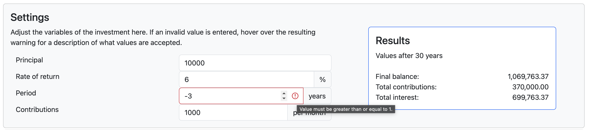

# Investment Return Dashboard

This project contains a [Dash](https://plotly.com/dash/) application that can be used to calculate and visualise the future value of an investment, including additional contributions and interest, over a given period of time. 

The investment settings are controlled through the dashboard interface, which also dynamically shows the resulting balance and its breakdown over time in interactive plots.

## Usage

The dashboard can be interacted with using a web browser. To install, use either the provided Dockerfile (see [Installation](#installation)) or build from source (see [Development](#development)).

When the application is running, navigate to `localhost:8050` in a web browser. Once opened, it should look like this:


The settings, results and interactive elements are described in the dashboard. Some notable features are:

- Custom tooltip when hovering over the line graph.  


- If percentages are selected to be shown on the pie chart, absolute values are displayed on hover and vice versa.  


- Custom CSS to indicate when an invalid value has been entered in an input field.  


## Installation

A [Docker](https://www.docker.com/) image can be built with the provided Dockerfile. To do so, run
```bash
docker build -t investment-dash-app .
```

from the project root directory. The production app is served by [gunicorn](https://gunicorn.org/) on port 8000, so spin up the container with
```bash
docker run -p 8000:8000 investment-dash-app
```

Navigate to `localhost:8000` in a browser to see the dashboard.

## Development

Development dependencies are handled using [conda](https://docs.conda.io/en/latest/) and can be installed by running
```bash
conda env create -f conda_env.yml
```

To run the application in debug mode:
```bash
python app.py --debug
```

### Tests

Backend logic tests are implemented with [pytest](https://docs.pytest.org/) and can be run by executing `pytest` from the project root directory.

Pre-commit hooks for formatting code with [black](https://github.com/psf/black) and [isort](https://pycqa.github.io/isort/) can be installed by running `pre-commit install` from the repository root directory.

Black and isort compliance as well as pytest checks are run automatically using GitHub workflows on GitHub-hosted runners during a pull request. This helps prevent logical errors and/or poorly formatted code from making its way into the repository and production. The pre-commit hooks and pytest tests described above can be used locally to catch non-compliant code before the pull request stage.